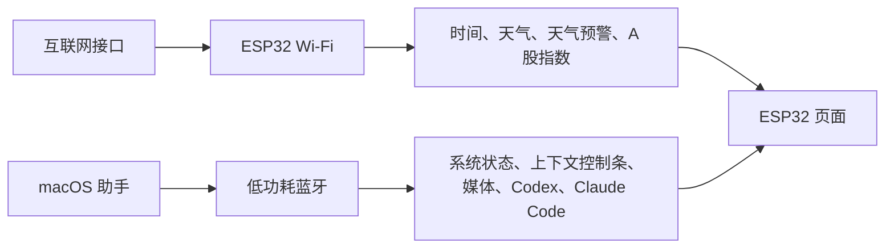
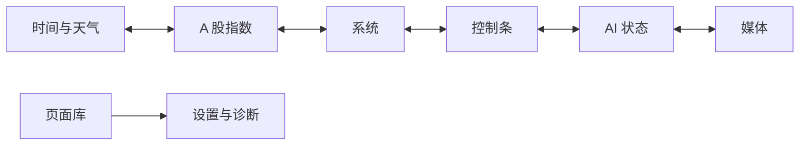
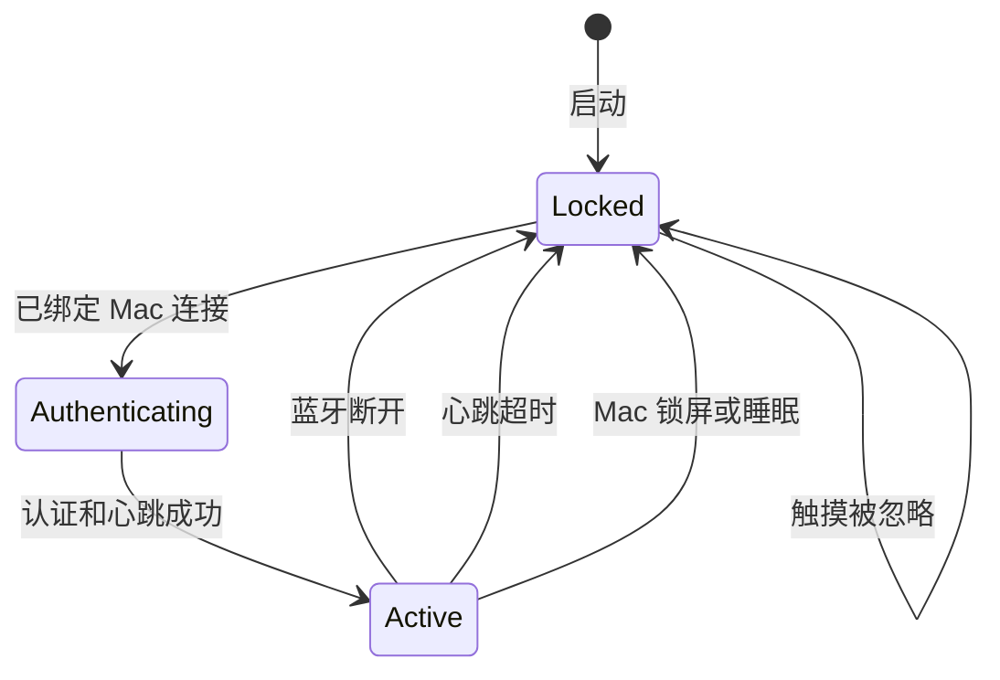

# ESP32-S3 桌面控制台：功能规划

> 版本：v3.2 双开发板基线  
> 日期：2026-08-16  
> 开发设备：微雪 ESP32-S3-Touch-LCD-4.3（无后缀）  
> 最终目标设备：微雪 ESP32-S3-Touch-LCD-4.3B（待到货验证）  
> 设计重点：高频信息合并、单页聚焦、固定程序坞、快捷操作、隐私优先

## 1. 产品范围

### 1.1 当前目标

硬件基线采用两块板分阶段验证：

- 现有开发板：`ESP32-S3-Touch-LCD-4.3`，无 `B` 或 `C` 后缀，用于开发环境、公共界面、Wi-Fi、蓝牙和 Mac 助手的早期开发。
- 已购最终板：`ESP32-S3-Touch-LCD-4.3B`，到货后完成背光、触摸、RTC、TF 卡和其他板载外设的实机验证。
- 公共规格：ESP32-S3-WROOM-1-N16R8，16MB Flash、8MB PSRAM、800×480 RGB 接口 IPS 屏和 I2C 电容触摸。
- 开发连接：日常烧录和串口日志使用板载 `UART` Type-C 接口。
- 工程使用编译时开发板配置；界面、网络、蓝牙协议和业务功能共用，引脚、背光和板载外设封装在独立适配层。
- 4.3B 到货前不将 4.3 的未验证固件直接用于最终设备。

设备当前承担四类能力：

1. 在首页集中显示时间与近期天气，并提供 A 股主要指数页面。
2. 通过蓝牙显示 Mac 系统状态并控制常用操作。
3. 显示 Codex 与 Claude Code 的用量和任务状态。
4. 提供联网、蓝牙、显示、隐私和设备诊断设置。

页面遵守三个限制：

- 一个页面只处理一个主题，最多承载两个紧密相关的任务。
- 时间与天气属于同一类高频环境信息，合并为首页。
- 市场、系统、电脑控制、AI 状态和媒体保持独立，避免首页变成综合仪表盘。

### 1.2 双通道架构



数据路径固定如下：

| 数据或动作 | 通道 | 说明 |
|---|---|---|
| 时间校准 | Wi-Fi | 通过网络时间协议同步，RTC 保持离线时间 |
| 天气与预警 | Wi-Fi | ESP32 直接请求天气接口 |
| A 股指数 | Wi-Fi | ESP32 直接请求行情接口 |
| Mac 系统状态 | 蓝牙 | 电脑助手采样后发送少量数值 |
| 上下文控制条 | 蓝牙 | Mac 发送当前应用和可用动作，ESP32 返回动作编号 |
| 媒体 | 蓝牙 | Mac 发送播放状态并执行控制 |
| Codex | 蓝牙 | Mac 读取本地 App Server 后发送用量和任务状态 |
| Claude Code | 蓝牙 | Mac 通过状态行与钩子收集用量和运行状态 |
| Wi-Fi 配置 | 蓝牙 | 已认证 Mac 向设备发送网络配置 |

Wi-Fi 连接只负责公共网络数据。所有与电脑有关的信息和操作都经过蓝牙。

### 1.3 当前保留与取消

一期保留：

- 时间与天气首页：当前时间、当前天气、未来几小时、今天、明天、灾害预警
- A 股主要指数
- 简洁系统监控
- 上下文控制条
- AI 状态：Codex 与 Claude Code 的用量和任务状态
- 媒体控制
- 设置与诊断

二期预留：

- 会议页面
- 隐私化通知页面
- 自动化页面

当前不做：

- 日程与日历
- 晨间简报和下班回顾
- 独立应用切换器
- 开发驾驶舱
- 小游戏、传感器和其他扩展玩法

应用相关操作集中到上下文控制条。一期遇到会议应用时，控制条可以显示静音、摄像头等少量动作；完整会议页面留到二期。

## 2. 页面与导航设计

### 2.1 信息架构

一期包含六个日常页面和一个工具入口：



- 左右滑动只在六个日常页面之间切换。
- 设置与诊断从页面库进入，避免误滑进入设置。
- 二期加入的会议、通知、自动化作为独立页面出现在页面库中，并可固定到程序坞。
- 页面顺序和程序坞固定项由用户调整，首页位置固定。

### 2.2 800×480 全局骨架

设备固定使用 `800×480` 横屏布局。一期不提供竖屏模式，所有页面、弹层、程序坞和触摸区域都以横屏尺寸验收。

```text
┌──────────────────────────────────────────────────────────┐
│ 24 px 状态栏：页面名              Wi-Fi  蓝牙  Mac 状态 │
├──────────────────────────────────────────────────────────┤
│                                                          │
│                    392 px 页面内容                       │
│                                                          │
├──────────────────────────────────────────────────────────┤
│ 64 px 程序坞：主页 市场 系统 控制 AI 媒体 页面库        │
└──────────────────────────────────────────────────────────┘
```

布局规则：

- 页面左右安全边距为 16 像素，主要区域间距为 12 像素。
- 普通可点击区域至少为 `56×56` 像素，常用动作优先做到 `64×56` 像素以上。
- 程序坞始终保留，不因页面内容隐藏，任何页面最多一次点击即可跳转到常用功能。
- 状态栏只显示页面名称和连接状态，不显示通知内容、项目路径或任务提示词。
- 点击状态栏连接图标，弹出精简连接面板；面板只显示网络名称、蓝牙设备和连接质量。

### 2.3 视觉语言

默认采用低眩光深色主题：

- 背景使用接近黑色的冷灰，不使用纯黑色大面积压暗细节。
- 主文字使用高对比浅色，次要信息降低一级亮度。
- 主强调色只用于当前页面、可操作控件和选中状态。
- 天气预警沿用官方等级颜色；A 股涨跌同时使用颜色、正负号和箭头，避免只靠颜色传达。
- 页面以留白和细分隔线组织内容，减少层层卡片、粗边框、渐变背景和装饰性阴影。

字体层级：

| 用途 | 建议字号 |
|---|---:|
| 首页时间 | 88～104 px |
| 关键数值 | 36～48 px |
| 页面标题或模块标题 | 20～24 px |
| 正文和按钮 | 16～18 px |
| 时间戳、单位和辅助说明 | 14～16 px |

所有数字使用等宽数字特性，刷新数值时不会左右跳动。界面文字不小于 14 像素。

### 2.4 底部程序坞

程序坞固定显示七个入口：

1. 首页
2. A 股指数
3. 系统
4. 控制条
5. AI 状态
6. 媒体
7. 页面库

交互规则：

- 当前页面图标使用短下划线和较高亮度表示，不使用大面积彩色底。
- 点击当前页面图标：回到该页默认状态并关闭临时弹层。
- 长按图标约 600 毫秒：进入程序坞编辑，可替换第 2～6 个入口。
- 首页和页面库固定在两端，避免编辑后找不到返回入口。
- 页面库采用 `3×3` 图标网格，只显示页面名称和状态点，不显示复杂摘要。

### 2.5 手势和操作反馈

- 页面空白区左右滑动：切换前后页面。
- 页面切换距离超过约屏幕宽度的 15%，或滑动速度达到阈值后才执行切换，降低误触。
- 滑块、媒体进度条和其他横向控件优先接收拖动，不触发换页。
- 首页的小时天气固定显示未来六小时，不使用横向滚动。
- 页面切换动画约 180 毫秒，弹层动画约 140 毫秒。
- 按下控件立即出现亮度反馈，执行成功后显示短暂状态文字。
- 锁定 Mac、离开会议、清除绑定和恢复出厂设置需要长按确认。

页面不依赖隐藏手势完成关键任务。高频功能可以从程序坞直接进入，危险操作必须有明确确认过程。

### 2.6 状态与异常表现

- 数据更新中：保留上一次数据，在时间戳旁显示轻量旋转标记。
- 数据过期：数值降低亮度并显示“更新于 15:20”，不使用空白页。
- 网络失败：页面顶部显示一行错误和“重试”，其余有效缓存继续显示。
- 蓝牙断开：立即执行隐私锁定和熄屏，不短暂展示离线页面。
- 无任务、无媒体或休市：展示单行状态和一个相关操作，不填充无意义卡片。

### 2.7 锁定与恢复

设备锁定后：

- 背光关闭。
- 触摸操作全部忽略。
- 程序坞、设置和页面内容均不可访问。
- Wi-Fi 可以保留连接，但只在后台维护必要缓存。
- 触摸屏幕不会显示天气、市场或连接详情。

设备重新通过已绑定 Mac 完成蓝牙认证和心跳后，渐亮屏幕并进入首页。恢复时不打开断开前的系统、AI 或媒体页面，减少他人看到缓存信息的机会。

## 3. 页面设计

### 3.1 时间与天气首页

用途：承担待机显示和每天最高频的信息查看。无需操作即可读到时间、当前天气、今天、明天和未来六小时。

无预警时的布局：

```text
┌──────────────────────────────────────────────────────────┐
│ 首页                                  Wi-Fi  蓝牙  Mac   │ 24
├───────────────────────┬──────────────────────────────────┤
│                       │  26°  多云      体感 28°         │
│        15:28          │                                  │
│   8月16日  星期日     │  今天 23～29°   明天 22～28°    │
├───────────────────────┴──────────────────────────────────┤
│ 16时     17时     18时     19时     20时     21时       │
│ 28°      27°      26°      25°      24°      24°        │
│ 20%      30%      60%      50%      20%      10%        │
├──────────────────────────────────────────────────────────┤
│ 首页   市场   系统   控制   AI   媒体   页面库          │ 64
└──────────────────────────────────────────────────────────┘
```

布局分工：

- 左侧约 38%：大号时间、日期和星期。
- 右侧约 62%：当前温度、天气状态、体感温度、今天和明天。
- 下方一整行：未来六小时的天气图标、温度和降雨概率。
- 秒数默认关闭，开启后以较小字号显示在分钟右侧。
- 首页不显示市场、系统曲线、AI 任务、媒体标题或通知计数。

天气预警：

- 有预警时，在状态栏下方插入 36 像素高的预警条，首页上半区相应缩短，小时天气保持完整。
- 预警条显示等级图标、短标题和右侧箭头，例如“暴雨橙色预警”。
- 点击后打开全屏详情层，显示发布时间、有效期、影响区域和简短防御建议。
- 多条预警只展示最高等级的一条，并标注“另有 2 条”；详情层中按等级和时间排列。
- 颜色采用预警数据中的官方级别颜色，同时保留文字等级。
- 预警数据可能延迟，详情中提示以当地官方发布为准。

天气数据：

- 当前温度、体感温度和天气状态。
- 今天与明天的最高温、最低温、天气和降雨概率。
- 从当前时间开始的未来六小时天气、温度和降雨概率。
- 台风、暴雨、雷电、高温、大风、寒潮等正在生效的预警。
- 数据更新时间只在数据过期或用户点击天气区域时显示。

点击右侧当前天气区域，可以切换显示体感温度、湿度和风力；首页一次只显示其中一个辅助指标。建议使用和风天气接口，其官方服务提供实时天气、逐小时预报、每日预报和天气预警。

### 3.2 A 股指数页

用途：快速查看常见 A 股指数的当前点位和涨跌。

首批固定指数：

| 指数 | 常用代码 |
|---|---|
| 上证综指 | `000001` |
| 深证成指 | `399001` |
| 创业板指 | `399006` |
| 科创 50 | `000688` |
| 沪深 300 | `000300` |
| 中证 500 | `000905` |

页面采用 `2×3` 等宽区域，每个区域只显示：

- 指数名称
- 当前点位
- 涨跌点数
- 涨跌百分比
- 涨跌方向箭头

六个区域之间只使用细分隔线，不绘制六个厚重卡片。页面标题右侧统一显示“交易中 / 已收盘”和数据时间。涨跌使用中国市场习惯的红涨绿跌，同时保留 `+/-` 和箭头。点击某个指数仅放大该指数并显示当日迷你走势，再次点击或向下滑动返回六指数总览。

页面不加入个股、自选股、新闻、成交排行和复杂走势图。行情只用于信息展示，不提供交易操作。

行情源需要满足三个条件：有文档的 HTTPS 接口、允许当前使用方式、可以返回以上指数。固件保留数据源适配层，避免绑定易变的网页抓取地址。

### 3.3 系统页

用途：用最小开销观察 Mac 的基本状态。

页面显示：

- CPU 使用率
- 内存使用率
- 磁盘剩余空间
- 网络上行与下行速度
- MacBook 电量作为状态栏可选项

布局采用 `2×2` 大数值区域：CPU、内存、磁盘、网络。每个区域包含名称、当前值和一条最近 60 秒的细线趋势；网络区域同时显示上下行。四个区域只使用分隔线组织，不增加二级页面。首版不显示进程排行、温度、风扇、容器、端口和外设列表。

默认每 2 秒采样一次。电脑助手把数值合并为一个小数据包，通过蓝牙发送给 ESP32。

资源目标：

- macOS 助手常态 CPU 占用目标低于 1%。
- macOS 助手内存目标控制在 50MB 左右。
- ESP32 每个指标只保留 30～60 个历史点。
- 曲线只在收到新数据时局部刷新。

按这个范围实现，系统监控对 Mac 和 ESP32 的压力都很低。高频进程扫描、每秒多次刷新和全屏曲线动画会显著增加消耗，因此不进入首版。

### 3.4 上下文控制条页

用途：实现接近 Mac Touch Bar 的操作体验。

电脑助手通过蓝牙发送当前前台应用。ESP32 根据应用自动切换控制条配置。没有专用配置时显示全局控制条。

页面结构：

```text
┌──────────────────────────────────────────────────────────┐
│ Safari                                      自动适配  ● │
├──────────────────────────────────────────────────────────┤
│  后退     前进      刷新     新标签     关闭     搜索    │
├──────────────────────────────────────────────────────────┤
│  音量 ━━━━━━━━━●━━━━    亮度 ━━━━━━●━━━━━━              │
├──────────────────────────────────────────────────────────┤
│ 首页   市场   系统   控制   AI   媒体   页面库          │
└──────────────────────────────────────────────────────────┘
```

首屏最多显示六个应用动作和两个连续控制项。动作数量超过六个时，最后一个位置显示“更多”，点击后打开动作网格；不在主页面横向滚动动作，避免和页面滑动冲突。

全局控制条建议：

- 应用列表
- 打开终端
- 区域截屏
- 显示桌面
- 勿扰模式
- 锁定 Mac
- 音量滑块
- 屏幕亮度滑块

应用专用示例：

| 应用类型 | 动作示例 |
|---|---|
| 浏览器 | 后退、前进、刷新、新标签、关闭标签、恢复标签、搜索 |
| Finder | 后退、前进、快速查看、新建文件夹、复制路径 |
| 终端 | 新标签、清屏、中断、分屏、查找、打开项目目录 |
| 编辑器 | 命令面板、文件搜索、运行、调试、格式化、终端开关 |
| 音乐或视频 | 上一首、播放暂停、下一首、进度和音量 |
| 会议应用 | 静音、摄像头、举手、共享、离开会议 |

一期不提供独立会议页面。会议应用处于前台时，控制条只显示最常用的 4～5 个动作；二期再加入会议专页。

首版配置由电脑端保存，ESP32 只接收动作编号、名称、图标和状态。锁屏、离开会议等动作需要长按确认。

### 3.5 AI 状态页

用途：在一页查看 Codex 和 Claude Code 的用量与当前运行状态。两者信息结构一致，适合并列展示。

布局：

```text
┌──────────────────────────────────────────────────────────┐
│ AI 状态                              2 个任务运行中      │
├────────────────────────────┬─────────────────────────────┤
│ Codex                      │ Claude Code                 │
│ 5小时  ███████░░  72%      │ 5小时  ████░░░░░  41%      │
│ 本周   ███░░░░░░  28%      │ 7天    ██████░░░  63%      │
│ ● 运行中  18:42            │ ◐ 等待输入  03:17          │
│ 任务 1              打开   │ 任务 1              打开   │
├────────────────────────────┴─────────────────────────────┤
│ 首页   市场   系统   控制   AI   媒体   页面库          │
└──────────────────────────────────────────────────────────┘
```

Codex 区域显示：

- 主要用量窗口的已用百分比和重置倒计时。
- 如果存在第二用量窗口，显示第二个进度条。
- 当前运行任务数量、状态和运行耗时。
- “打开”操作用于在 Mac 上激活 Codex。

Claude Code 区域显示：

- 五小时与七天用量窗口；缺失的套餐字段明确显示“不可用”。
- 当前上下文使用率作为可选替代项。
- 当前任务状态和运行耗时。
- “打开”操作用于激活对应终端窗口。

状态只使用六种：运行中、等待权限、等待输入、完成、失败、空闲。颜色之外同时使用图形和文字。只有“等待权限”和“失败”使用高注意力颜色，其余状态保持克制。

隐私限制：

- 不显示提示词和回复正文。
- 不显示完整项目路径。
- 任务名称默认使用“任务 1”“任务 2”等通用名称。
- 一期只提供查看和打开应用，不在设备上批准权限或发送消息。

OpenAI 官方 App Server 可以提供配额和任务状态事件。Claude Code 状态行与生命周期钩子可以提供部分套餐用量、上下文和任务阶段。本地助手把两者整理为相同结构，再通过蓝牙发送精简结果。

### 3.6 媒体页

用途：控制 Mac 当前播放的音频或视频。

显示内容：

- 曲名或视频标题，可在隐私设置中关闭。
- 播放或暂停状态。
- 上一首、播放暂停、下一首。
- 播放进度。
- 音量与静音。

首版不传输大尺寸封面，不制作歌词页，不加入播放列表管理。媒体页面和上下文控制条可以共享同一套媒体状态。

### 3.7 设置与诊断页

设置页采用四个入口，每次只进入一个设置主题。

#### 网络

- Wi-Fi 开关、当前网络、信号强度和 IP 地址。
- 添加网络、忘记网络和重新连接。
- 天气接口状态、行情接口状态和最后成功时间。
- 首版支持 2.4GHz 常规个人网络；企业认证和网页认证网络后续评估。

#### 蓝牙

- 已绑定 Mac、连接状态、信号强度和心跳状态。
- 重新连接和清除绑定。
- 配对模式只能通过设备物理按键进入。

#### 显示与隐私

- 亮度、主题、页面顺序和程序坞配置。
- 蓝牙断开后的熄屏延时，默认 0 秒。
- 任务名称和媒体标题显示开关。
- 通知标题与正文不提供开启选项。

#### 诊断

- 固件版本、运行时间、可用内存和 PSRAM。
- Wi-Fi、蓝牙、天气和行情接口测试。
- 触摸测试、屏幕测试和 RTC 状态。
- 最近一次错误代码和重连次数。

## 4. 技术与安全设计

### 4.1 蓝牙亮灭屏状态机



具体规则：

1. 设备启动时保持锁定和熄屏。
2. Wi-Fi 连接成功不会解锁屏幕。
3. 已绑定 Mac 建立蓝牙连接后执行应用层认证。
4. 认证和心跳成功后渐亮屏幕并启用触摸。
5. 蓝牙断开事件发生后立即清除敏感页面状态、锁定触摸并关闭背光。
6. 蓝牙链路仍存在但电脑助手心跳丢失超过 6 秒时执行相同流程。
7. Mac 锁屏、睡眠或用户注销时，电脑助手主动发送锁定事件。
8. 恢复连接后重新认证，成功后统一进入时间与天气首页。

锁定状态下 ESP32 拒绝全部 Mac 控制动作。断开前缓存的 Codex、Claude Code、媒体和系统数据不会显示。

### 4.2 通知与隐私

- 一期不建立通知页面，二期加入隐私化通知页。
- 电脑助手不发送通知标题、正文、联系人和消息预览。
- 二期通知只允许发送应用类别、数量、优先级和到达时间。
- AI 页面不发送提示词、回答、文件名和完整项目路径。
- Wi-Fi 密码和接口凭据不出现在屏幕及普通日志中。
- 敏感数据只保存在 Mac 内存，不写入 ESP32 闪存或 TF 卡。
- 天气和指数属于公共缓存，设备锁定后同样保持熄屏。
- 清除蓝牙绑定、修改 Wi-Fi 和恢复出厂设置需要已认证 Mac 或物理按键确认。

### 4.3 Wi-Fi 与蓝牙共存

ESP32-S3 的 Wi-Fi 和蓝牙共享 2.4GHz 射频，通过分时机制共存。官方文档将 Wi-Fi 站点模式与已连接低功耗蓝牙列为稳定支持场景。

实现策略：

- 启用 ESP-IDF 的 Wi-Fi/蓝牙软件共存功能。
- Wi-Fi 与蓝牙协议栈任务分配到不同 CPU 核心。
- 天气和行情请求采用短连接或可复用 HTTPS 连接。
- 网络请求顺序执行，避免天气、预警和行情同时进行 TLS 握手。
- 先解析需要字段，立即释放完整 JSON 响应。
- 蓝牙动作与心跳优先，网络更新允许延后数秒。

天气、指数和控制消息的数据量都很小，这种使用方式适合 Wi-Fi 与蓝牙同时在线。

### 4.4 数据刷新

| 数据 | 正常刷新 | 蓝牙断开、屏幕关闭 |
|---|---:|---:|
| 网络时间 | 每 6 小时 | 保持 |
| 实时天气 | 每 15～20 分钟 | 每 60 分钟 |
| 今天与明天 | 每 60 分钟 | 每 3 小时 |
| 未来小时天气 | 每 30～60 分钟 | 每 3 小时 |
| 天气预警 | 每 5 分钟 | 每 15 分钟 |
| A 股指数 | 交易时段每 30 秒 | 暂停 |
| A 股指数 | 休市后每 30 分钟 | 暂停 |
| Mac 系统状态 | 每 2 秒 | 停止 |
| 上下文控制条 | 前台应用变化时 | 停止 |
| Codex 与 Claude Code | 事件驱动 | 停止发送 |
| 媒体状态 | 事件驱动 | 停止发送 |

蓝牙重新连接后，设备立即刷新天气、预警和指数，再恢复正常周期。

### 4.5 资源控制

板载 16MB Flash 和 8MB PSRAM 足以支持当前范围。

- 800×480、16 位色完整帧约占 750KB，双缓冲约占 1.5MB。
- 页面以静态组件为主，切页动画短暂运行。
- 系统曲线最多保留 60 个点。
- HTTPS 响应设置大小上限，逐字段解析。
- 天气和指数图标采用本地资源，不在每次刷新时下载。
- 不实现桌面镜像、视频背景和全屏高帧率动画。

项目已经配备 microSD 卡。固件本体、启动所需资源和关键设置仍保留在板载 Flash；运行日志、诊断导出、截屏、大型主题资源、照片和动画优先写入 microSD。

存储卡写入以性能稳定为先：

- 日志先进入内存队列，由低优先级存储任务批量写入，界面和蓝牙任务不直接等待文件系统。
- 常规日志按日期和文件大小轮换，限制单个文件大小，避免目录长期膨胀影响扫描速度。
- 高频指标保存在内存环形缓冲区，只定期落盘或在故障发生时导出。
- 存储卡拔出、写满或损坏时，核心功能继续运行；关键错误暂存在内存和板载 Flash 的小型诊断区。
- Wi-Fi 密码、蓝牙共享密钥、AI 内容和通知正文不写入日志或存储卡。
- 截屏、资源包和长期诊断记录允许充分使用存储卡容量，无需为节省几兆空间牺牲可维护性。

### 4.6 开发启动基线

一期建议采用以下工程划分：

```text
firmware/                 ESP32-S3 固件主工程
├── main/                 启动、任务编排和页面注册
└── components/
    ├── board/            4.3/4.3B 选型、屏幕、背光和触摸适配
    ├── ui/               LVGL 主题、组件、页面和程序坞
    ├── network/          Wi-Fi、时间、天气和指数
    ├── ble_link/         认证、心跳、状态和控制消息
    └── storage/          设置、绑定信息和公共缓存
macos-helper/             macOS 蓝牙助手，阶段 E 开始建设
protocol/                 蓝牙消息编号、字段和版本说明
docs/                     功能、设计、协议和开发记录
```

技术基线：

- 固件锁定 ESP-IDF v5.5.5，界面使用 LVGL 9 及乐鑫官方 `esp_lvgl_adapter`。
- 开发板默认选择现有的 4.3 无后缀版；4.3B 配置在新板到货后才进入实机烧录验收。
- UI 第一阶段全部使用模拟数据，先确认横屏排版、触摸、滑动、程序坞和内存占用。
- 页面采用静态创建与按需刷新，避免切页时反复申请大块内存。
- 网络、蓝牙和界面通过消息队列交互，网络请求不阻塞触摸与动画。
- Wi-Fi 密码、天气密钥和行情凭据使用本地配置，不写入代码仓库。
- macOS 助手优先采用 Swift 实现，以便使用系统蓝牙、辅助功能和媒体控制能力。

第一次开发迭代只完成以下闭环：

1. 官方屏幕示例可以稳定显示，触摸坐标与横屏方向一致。
2. 背光可以由软件渐亮、渐暗和彻底关闭。
3. 建立 800×480 页面骨架、状态栏、程序坞和时间天气首页。
4. 使用模拟数据切换六个页面，连续快速滑动不崩溃、不明显掉帧。
5. 记录启动时间、空闲内存、PSRAM 使用量和界面刷新帧率，形成首份开发基线。

### 4.7 当前开发顺序

| 阶段 | 内容 |
|---|---|
| A | 界面基础组件、时间天气首页、触摸、背光、页面滑动和底部程序坞 |
| B | 蓝牙绑定、应用层认证、心跳、锁定和自动亮灭屏 |
| C | Wi-Fi 配置、网络时间、天气、六小时预报和天气预警 |
| D | A 股指数接口与六指数页面 |
| E | macOS 助手、基础系统状态和上下文控制条 |
| F | AI 状态页、Codex、Claude Code 和媒体状态 |
| G | 设置、诊断、异常恢复和长期运行测试 |

### 4.8 当前验收标准

- 六个日常页面可以通过滑动和程序坞稳定切换，设置可以从页面库进入。
- 每个页面保持单一主题，没有综合信息堆叠。
- ESP32 直接通过 Wi-Fi 获取天气、预警和指数。
- 所有 Mac 信息与动作只通过蓝牙传输。
- 蓝牙断开后立即锁定触摸并熄屏。
- 断开状态下触摸无法打开页面、设置或控制 Mac。
- 首页清晰显示时间、当前天气、今天、明天、未来六小时和有效预警。
- 指数页只显示六个主要 A 股指数。
- 系统监控连续运行时不造成明显 CPU 和内存负担。
- AI 状态页只显示 Codex 与 Claude Code 的用量、运行状态和耗时。
- 通知标题、正文和 AI 任务内容不会传到设备。
- Wi-Fi 故障、接口故障和数据过期都有清晰状态。

### 4.9 参考资料

- [微雪 ESP32-S3-Touch-LCD-4.3 官方资料](https://docs.waveshare.com/ESP32-S3-Touch-LCD-4.3)
- [微雪 ESP32-S3-Touch-LCD-4.3B 官方资料](https://docs.waveshare.com/ESP32-S3-Touch-LCD-4.3B)
- [乐鑫 ESP32-S3 Wi-Fi 与蓝牙共存说明](https://docs.espressif.com/projects/esp-idf/en/stable/esp32s3/api-guides/coexist.html)
- [乐鑫 ESP HTTP Client 与 HTTPS](https://docs.espressif.com/projects/esp-idf/en/stable/esp32s3/api-reference/protocols/esp_http_client.html)
- [和风天气逐小时天气预报](https://dev.qweather.com/docs/api/weather/weather-hourly-forecast/)
- [和风天气实时天气预警](https://dev.qweather.com/docs/api/warning/weather-alert/)
- [上海证券交易所指数简介](https://www.sse.com.cn/market/sseindex/overview/)
- [深圳证券交易所指数总览](https://www.szse.cn/market/exponent/pandect/index.html)
- [OpenAI Docs：Codex App Server](https://learn.chatgpt.com/docs/app-server)
- [Claude Code：自定义状态行](https://code.claude.com/docs/en/statusline)
- [Claude Code：生命周期钩子](https://code.claude.com/docs/en/hooks-guide)

## 5. 未来功能暂存

本节只保存想法，不进入当前开发排期。

### 5.1 二期：会议页面

- 仅在检测到会议进行中时提供快速入口，也可以固定到程序坞。
- 主界面只显示会议时长、麦克风、摄像头、共享状态和离开会议。
- 静音和摄像头使用大按钮，当前状态通过文字、图标和颜色共同表达。
- 离开会议需要长按确认；参会人列表、聊天和会议内容不传到设备。
- 支持主流会议应用前，需要逐个验证 macOS 可调用的安全控制方式。

### 5.2 二期：隐私化通知页面

- 只显示应用类别、未读数量、优先级和到达时间。
- 不传输标题、正文、联系人、头像、验证码和消息预览。
- 默认分类为工作、通讯、系统和其他；点击分类只在 Mac 上打开对应应用。
- 支持“全部暂时静音”和“开启专注模式”，不在设备上回复消息。
- 蓝牙断开时立即清空通知计数和分类缓存。

### 5.3 二期：自动化页面

- 一键开工、专注、会议和离岗场景。
- 顺序动作、延时、条件判断和失败处理。
- 根据时间、前台应用或蓝牙状态自动触发。
- 每个自动化在设备上显示名称、预计动作数和当前状态。
- 执行前列出会影响的应用；锁屏、关机、退出程序等动作需要确认。
- 自动化逻辑和凭据保存在 Mac，ESP32 只发送触发编号并接收执行进度。

### 5.4 信息扩展

- 日程和日历。
- 晨间简报和下班回顾。
- 空气质量、通勤和更多市场品种。

### 5.5 工具扩展

- 截屏预览、文字识别和二维码。
- 剪贴板货架和固定文本片段。
- 计算器、单位换算、秒表和多时区。
- 虚拟触控板和演示指针。

### 5.6 开发扩展

- Git、构建、测试和本地服务。
- 持续集成、容器、接口健康和错误摘要。
- 更丰富的 Codex 与 Claude Code 任务控制。

### 5.7 个性与硬件扩展

- 主题、像素伙伴、小游戏、照片和动画。
- 环境光、温湿度、二氧化碳和空气质量传感器。
- 脚踏开关、机械按键和 RGB 状态灯。
- USB/BLE 双模式、便携演示器和多电脑切换。
- CAN、RS485、隔离输入输出和 Home Assistant。

未来开发时继续沿用当前页面原则：每个页面聚焦一到两个任务。会议、通知和自动化优先做成独立页面，通过页面库进入，也可以固定到程序坞。
