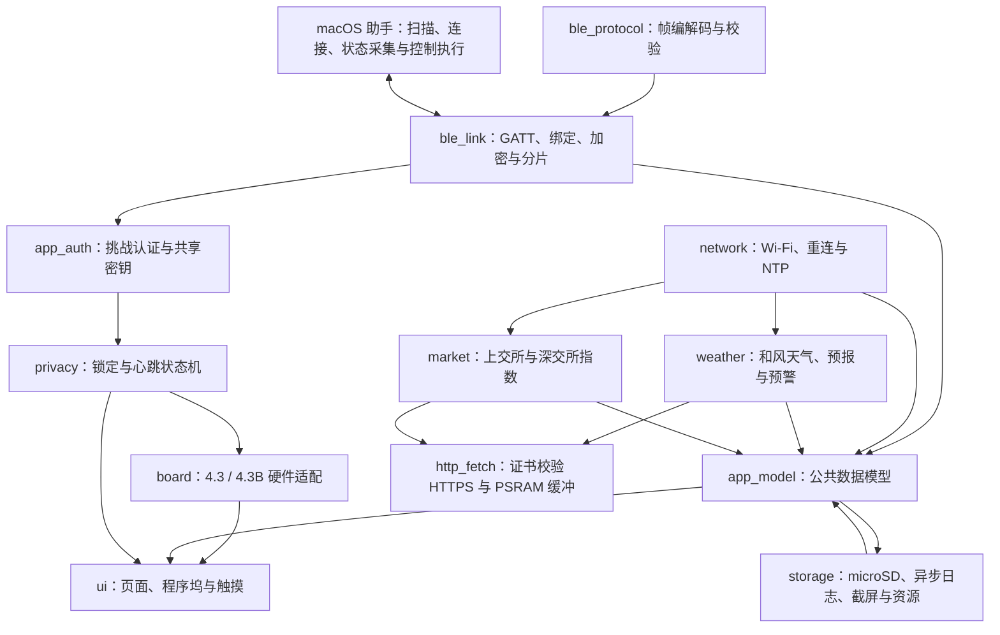

# ESP32-S3 桌面控制台：技术架构

> 版本：v1  
> 更新日期：2026-08-18

## 1. 总体结构

## 2. 状态所有权

- `app_model` 是页面的唯一数据来源。页面不直接读取 Wi-Fi、BLE 或系统接口。
- 网络任务只更新天气、预警和指数等公共数据。
- BLE 任务只更新系统、控制条、AI 和媒体等 Mac 数据。
- 锁定事件的优先级高于页面刷新。触发锁定后先关背光和禁用触摸，再清理私有数据。
- UI 只在 LVGL 锁内创建或更新控件。

## 3. 公共与私有数据

| 数据 | 来源 | 锁定时内存 | 写入 Flash |
|---|---|---|---|
| 时间、天气、预警 | Wi-Fi | 可保留 | 可保留最近成功结果 |
| A 股指数 | Wi-Fi | 可保留 | 可保留当日最后结果 |
| Mac 系统状态 | BLE | 立即清除 | 否 |
| 前台应用和控制条 | BLE | 立即清除 | 否 |
| Codex / Claude Code | BLE | 立即清除 | 否 |
| 媒体状态 | BLE | 立即清除 | 否 |
| Wi-Fi 凭据、蓝牙绑定密钥、应用认证密钥 | 设置 | 保留 | NVS，日志永不输出原文 |

## 4. 任务划分

| 任务 | 建议周期 | 优先级 | 说明 |
|---|---:|---:|---|
| LVGL | 5～15ms | 高 | 触摸、动画和页面刷新 |
| 隐私监督 | 250ms | 最高 | 检查心跳超时，不执行耗时工作 |
| BLE 收发 | 事件驱动 | 高 | 认证、心跳、状态和控制 |
| 网络 | 定时 | 中 | HTTPS 请求串行执行 |
| 存储 | 事件驱动 | 低 | 有界队列、批量写卡、故障重试 |

存储任务采用 32 项有界队列，每 8 条或 2 秒批量刷新，单文件达到 2MB 后轮转。挂载和写入故障不会阻塞调用方，任务等待 10 秒后重试。日志、截屏与大型资源进入 microSD；界面、隐私监督、蓝牙心跳和触摸回调中禁止同步文件写入。

板载 microSD 使用 GPIO 11/13/12 的独立 SPI 总线，片选由 CH422G 扩展口控制。`board` 组件维护 CH422G 只写输出寄存器的影子值，使背光与 SD 片选更新互不覆盖。存储卡挂载失败时不会自动格式化。

隐私监督使用单调毫秒时间，不依赖网络时间。心跳超时判断已考虑 32 位毫秒计数回绕。

蓝牙传输当前采用 NimBLE 单外设、单连接配置。GATT 回调负责加密链路上的分片收发和帧校验，随后把定长事件投递给隐私监督任务。应用层认证通过随机挑战和 HMAC-SHA256 验证 Mac 持有的共享密钥；Secure Connections 加密成功只代表链路可用，不会直接把设备切换到已认证活动状态。

公共网络链路采用 ESP32 Station 模式。Wi-Fi 配置由已认证 Mac 通过蓝牙写入，凭据交给 ESP-IDF 保存在 NVS。设备连接成功后启动 NTP；天气与行情任务等待系统时间有效再发起 TLS。`http_fetch` 使用 ESP 证书包验证服务端证书，响应体与网络任务栈优先放入 PSRAM，并用全局互斥锁避免两个 TLS 握手同时消耗内部内存。

天气任务每 15 分钟读取当前天气、未来 6 小时、今明两天和有效预警。行情任务在交易时段每 60 秒读取上交所与深交所官方接口，非交易时段降低到 15 分钟。失败时保留最近一次有效内存状态，不把公共接口故障扩散到蓝牙、触摸或隐私监督。

macOS 助手采用菜单栏常驻形式，按专用服务 UUID 扫描设备，发现写入、事件和状态三条特征后订阅状态变化。连接断开时使用有上限的退避重试。随机挑战认证、助手私有密钥文件、2 秒心跳、系统锁屏/睡眠监听、系统状态、控制动作、媒体键和 AI 状态采集均已接入。私有存储目录权限为 `0700`、文件权限为 `0600`，运行期不调用钥匙串接口。

### 4.1 内部/PSRAM 内存预算（实机联调沉淀）

ESP32-S3 内部 SRAM 总量 512KB（启动后可用堆约 355KB），Wi-Fi + BLE + TLS + 图形同时启用时**内部 RAM 是稀缺资源**（实测两次触顶：BT 控制器 30KB 连续块分配失败、mbedtls TLS 缓冲分配失败）。8MB PSRAM 才是业务数据的主内存。**规则：能进 PSRAM 的全进 PSRAM，内部 RAM 只留给硬件强制要求的底。**

| 去向 | 组件 | 说明 |
|---|---|---|
| 必须内部（硬底） | BT 控制器 ~30KB、Wi-Fi 驱动 ~120KB、lwIP 核心、静态代码/数据、DMA 描述符 | 无法外移，需预留 |
| 已移到 PSRAM | NimBLE 主机（`BT_NIMBLE_MEM_ALLOC_MODE_EXTERNAL`）、mbedtls TLS（`MBEDTLS_EXTERNAL_MEM_ALLOC`）、LVGL 帧缓冲/任务栈、HTTP 响应缓冲、天气/行情解析缓冲、字体与资源（XIP） | 见 sdkconfig.defaults |
| 内部 RAM 节流项 | Wi-Fi 静态 rx 6 / 动态 16、`SPIRAM_MALLOC_ALWAYSINTERNAL=16`、LCD 弹跳缓冲 4 行 | 实测稳定，业务流量下无需回退 |

新增组件/功能时的核对清单：

1. 缓冲、解析树、图像、任务栈 → PSRAM（`MALLOC_CAP_SPIRAM`）；
2. 只有 DMA/中断/低延迟要求才用内部 RAM，且要计入硬底预算；
3. TLS 连接保持互斥串行（同时最多一个握手，避免内部内存峰值叠加）；
4. 实机用 `heap_caps_get_free_size(MALLOC_CAP_INTERNAL)` 与最大连续块验证余量（BT 控制器需要 30KB 连续块的历史教训）。

## 5. 页面更新

- 首页时间每秒更新，天气区只在数据版本变化时更新。
- 指数页在新行情到达时更新，不持续重绘全页。
- 系统曲线每 2 秒追加一个点，CPU 与内存各保留 30 个点，覆盖最近 60 秒。
- 控制条只在前台应用或动作状态变化时重建。
- AI 和媒体页使用事件更新。

已实现的页面绑定会在普通状态更新时直接修改当前控件。预警条出现或消失、系统/AI/媒体页面在有效数据与隐私清空状态之间切换时，才重建当前页面结构。

## 6. 可在无开发板时验证的内容

- 蓝牙帧编码、解码、长度检查和 CRC。
- 启动、认证、断开、心跳超时和 Mac 锁屏状态转换。
- 锁定后私有数据清理，且公共天气和行情缓存保留。
- 固件全量编译和分区容量检查。
- 页面对统一模拟数据的绑定。
- microSD 日志轮转、单行规范化、隐私替换和文件命名策略的主机侧测试。

## 7. 需要实机的内容

- RGB 色序、时序、屏幕刷新和 PSRAM 稳定性。
- GT911 触摸坐标、滑动阈值和边缘触摸。
- 背光开关、渐亮渐暗以及 CH422G 其他位的影响。
- BLE 广播、Mac 扫描、连接、服务发现、加密绑定、应用认证、MTU 247 与持续心跳已经通过实机验证。下一轮需要验证 Wi-Fi/蓝牙共存、真实天气与行情、媒体键、AI 状态以及断连熄屏时延。
- 4.3B 的 RTC、TF 卡、CAN、RS485 和隔离输入输出。
- microSD 插拔、写满、断电恢复和持续写入性能。
