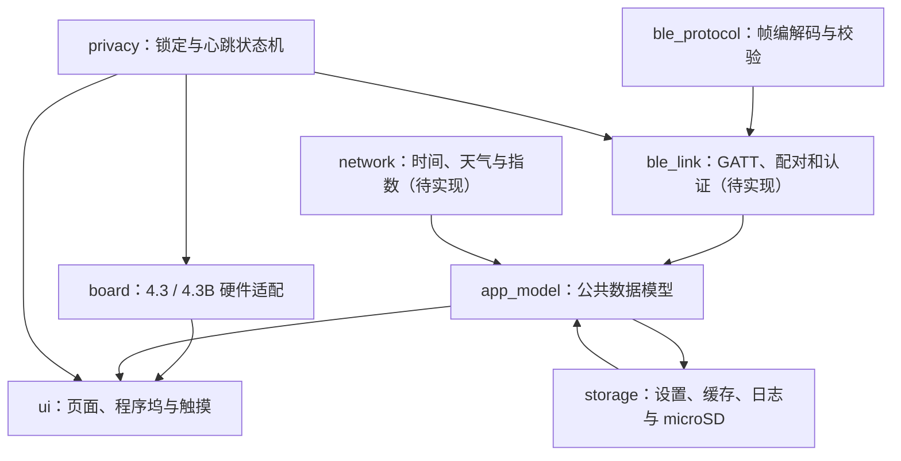

# ESP32-S3 桌面控制台：技术架构

> 版本：v1  
> 更新日期：2026-08-16

## 1. 总体结构

## 2. 状态所有权

- `app_model` 是页面的唯一数据来源。页面不直接读取 Wi-Fi、BLE 或系统接口。
- 网络任务只更新天气、预警和指数等公共数据。
- BLE 任务只更新系统、控制条、AI 和媒体等 Mac 数据。
- 锁定事件的优先级高于页面刷新。触发锁定后先关背光和禁用触摸，再清理私有数据。
- UI 只在 LVGL 锁内创建或更新控件。

## 3. 公共与私有数据

| 数据 | 来源 | 锁定时内存 | 写入 Flash |
|---|---|---|---|
| 时间、天气、预警 | Wi-Fi | 可保留 | 可保留最近成功结果 |
| A 股指数 | Wi-Fi | 可保留 | 可保留当日最后结果 |
| Mac 系统状态 | BLE | 立即清除 | 否 |
| 前台应用和控制条 | BLE | 立即清除 | 否 |
| Codex / Claude Code | BLE | 立即清除 | 否 |
| 媒体状态 | BLE | 立即清除 | 否 |
| Wi-Fi 凭据、绑定密钥 | 设置 | 保留 | NVS，日志永不输出原文 |

## 4. 任务划分

| 任务 | 建议周期 | 优先级 | 说明 |
|---|---:|---:|---|
| LVGL | 5～15ms | 高 | 触摸、动画和页面刷新 |
| 隐私监督 | 250ms | 最高 | 检查心跳超时，不执行耗时工作 |
| BLE 收发 | 事件驱动 | 高 | 认证、心跳、状态和控制 |
| 网络 | 定时 | 中 | HTTPS 请求串行执行 |
| 存储 | 事件驱动 | 低 | 合并写入，避免频繁擦写 Flash |

存储任务采用有界队列和批量写入。日志、截屏与大型资源优先进入 microSD；界面、隐私监督、蓝牙心跳和触摸回调中禁止同步文件写入。

隐私监督使用单调毫秒时间，不依赖网络时间。心跳超时判断已考虑 32 位毫秒计数回绕。

## 5. 页面更新

- 首页时间每秒更新，天气区只在数据版本变化时更新。
- 指数页在新行情到达时更新，不持续重绘全页。
- 系统曲线每 2 秒追加一个点，每个指标最多 60 个点。
- 控制条只在前台应用或动作状态变化时重建。
- AI 和媒体页使用事件更新。

## 6. 可在无开发板时验证的内容

- 蓝牙帧编码、解码、长度检查和 CRC。
- 启动、认证、断开、心跳超时和 Mac 锁屏状态转换。
- 锁定后私有数据清理，且公共天气和行情缓存保留。
- 固件全量编译和分区容量检查。
- 页面对统一模拟数据的绑定。
- microSD 日志队列、轮换策略和文件格式的主机侧测试。

## 7. 需要实机的内容

- RGB 色序、时序、屏幕刷新和 PSRAM 稳定性。
- GT911 触摸坐标、滑动阈值和边缘触摸。
- 背光开关、渐亮渐暗以及 CH422G 其他位的影响。
- BLE 广播、配对、MTU、心跳时延和 Wi-Fi 共存。
- 4.3B 的 RTC、TF 卡、CAN、RS485 和隔离输入输出。
- microSD 插拔、写满、断电恢复和持续写入性能。
